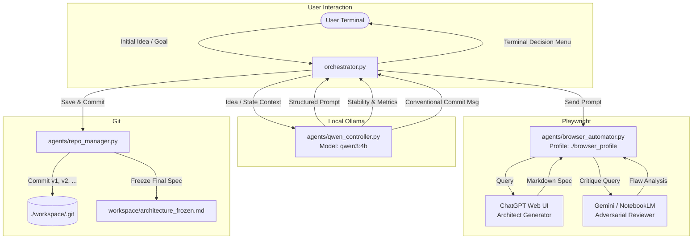
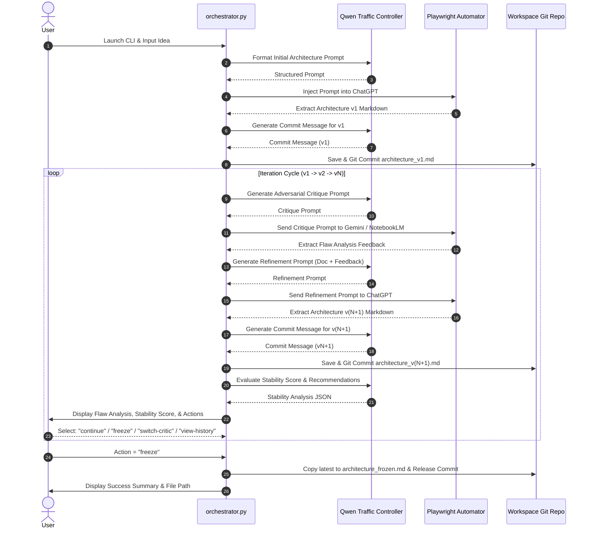

# Iterative Software Architecture Design Orchestrator
## Comprehensive Architecture & User Guide

---

## 1. System Overview

The **Iterative Software Architecture Design Orchestrator** is a local Python-based automation pipeline designed to autonomously synthesize, critique, and evolve production-grade software architecture specifications.

The system combines three foundational pillars:
1. **Local Traffic Controller (Ollama + `qwen3:4b`)**: Acts as the cognitive coordinator and prompt engineer. It does not write architecture directly; instead, it parses states, formats high-density prompts for frontier models, evaluates iteration stability, and crafts Git commit messages.
2. **Persistent Browser Automation (Playwright)**: Maintains authenticated sessions for **ChatGPT**, **Gemini**, and **NotebookLM** without requiring programmatic API keys or re-login routines.
3. **Workspace Version Control (Local Git)**: Maintains an isolated Git repository under `./workspace/`, tracking each iteration as `architecture_v1.md`, `architecture_v2.md`, etc., culminating in a frozen release `architecture_frozen.md`.

---

## 2. Architecture Diagram



---

## 3. Project Structure

```
AruDocCreator/
├── gui_app.py                     # Main PySide6 Desktop GUI Application
├── orchestrator.py                # Standalone CLI Orchestration Application
├── open_browser_window.py         # Chrome CDP launcher helper
├── login_browser.py               # Standalone browser authentication helper
├── launch_chrome_with_debug.bat   # Windows batch launcher (Port 9222)
├── agents/
│   ├── __init__.py                # Package exports
│   ├── qwen_controller.py        # Ollama Qwen meta-prompting & state evaluator
│   ├── browser_automator.py      # Playwright persistent context & web UI scraper
│   └── repo_manager.py           # Git repository & file versioning manager
├── tests/
│   └── test_orchestrator_components.py  # Unit tests for repo and controller
├── workspace/                     # Dedicated Git repository for architecture documents
│   ├── .git/                     # Initialized repository
│   └── architecture_frozen.md    # Final signed-off specification
├── browser_profile/              # Persistent Chromium session cookies and state
├── config.json                   # System settings, timeouts, model IDs, URLs
├── requirements.txt              # Python package dependencies
├── README.md                      # Quickstart documentation
└── DOCUMENTATION.md              # System documentation
```


---

## 4. Component Details

### 4.1. Local Traffic Controller (`agents/qwen_controller.py`)

* **Role**: Orchestration decision-maker, prompt synthesizer, and stability auditor.
* **Why local Qwen?** By keeping coordination local, no tokens or API fees are expended on meta-prompting, commit generation, or state parsing.
* **Core Methods**:
  * `check_health()`: Verifies local Ollama server status at `http://localhost:11434` and checks if `qwen3:4b` (or configured fallback) is available.
  * `generate_initial_chatgpt_prompt(user_idea)`: Builds an exhaustive prompt requiring executive summary, component topologies (Mermaid), data flow, schemas, security, and edge cases.
  * `generate_critique_prompt(architecture_doc, focus_areas)`: Formulates an adversarial peer-review prompt for Gemini / NotebookLM targeting single points of failure (SPOFs), bottlenecks, and security gaps.
  * `generate_refinement_prompt(current_doc, critique_feedback, iteration)`: Formulates a structured prompt directing ChatGPT to address all critique findings in the next revision.
  * `generate_commit_message(version, changes_summary)`: Generates Conventional Commits (e.g., `feat(arch): revision v2 - resolve distributed consensus bottleneck`).
  * `evaluate_iteration_stability(architecture_doc, critique_feedback)`: Evaluates stability score (1–10), lists major improvements, remaining concerns, and suggests `continue` vs `freeze`.

### 4.2. Browser Automator (`agents/browser_automator.py`)

* **Role**: Browser lifecycle and UI interaction with ChatGPT, Gemini, and NotebookLM.
* **Persistent Context**: Uses `playwright.chromium.launch_persistent_context(user_data_dir="./browser_profile")` to preserve logins across runs.
* **DOM-Safe Large Prompt Injection**:
  * Directly injecting large architecture documents (>10 KB) into textareas via keystroke typing causes latency and character loss.
  * `_safe_input_text()` uses JavaScript event dispatching (`InputEvent` + `dispatchEvent`) for instantaneous, error-free text insertion.
* **Streaming Settlement & Completion Detection**:
  * Monitors the disappearance of UI stop buttons (`data-testid="stop-button"`).
  * Implements a DOM debounce loop that samples response length until the text remains stable for `stream_settle_timeout_ms` (default 4 seconds).
* **Supported Services**:
  * `query_chatgpt(prompt, new_chat=False)`: Navigates to ChatGPT, inputs prompt, waits for generation, extracts markdown.
  * `query_gemini(prompt, new_chat=False)`: Sends architecture doc to Gemini for adversarial critique.
  * `upload_source_and_review_in_notebooklm(notebook_url, file_path, doc_title, doc_prefix_or_num)`:
    1. Navigates to the designated NotebookLM notebook URL (e.g. `https://notebooklm.google.com/notebook/b7a81a2b-5485-493a-bbfb-cbe58808dfc3`).
    2. Uploads the generated `architecture_v{N}.md` directly into NotebookLM sources.
    3. Prompts NotebookLM to perform a cross-document comparative evaluation against the existing 37+ specification documents in the notebook.
    4. Extracts actionable critique feedback to guide the next refinement iteration.


### 4.3. Workspace Repository Manager (`agents/repo_manager.py`)

* **Role**: Local Git repository management and document versioning.
* **Storage Location**: `./workspace/`.
* **Features**:
  * Initializes `.git` with default committer metadata (`Architecture Orchestrator <orchestrator@local>`).
  * `save_revision(version, content, commit_message)`: Writes `architecture_v{N}.md` and creates a Git commit.
  * `freeze_design(final_version)`: Duplicates the latest specification to `architecture_frozen.md` and creates a release commit.
  * `get_commit_history()`: Retrieves recent commit logs for terminal inspection.

### 4.4. CLI Orchestrator (`orchestrator.py`)

* **Role**: Interactive entry point running the full 7-step execution loop.
* **UI Features**: Terminal rendering with `rich` panels, markdown preview, tables, and fallback to standard ANSI streams.

---

## 5. Execution Pipeline (Step-by-Step)



---

## 6. Installation & Prerequisites

### 6.1. Install Python Dependencies
```bash
pip install -r requirements.txt
playwright install chromium
```

### 6.2. Start Ollama with Qwen
Ensure Ollama is running locally and pull `qwen3:4b` (or `qwen2.5:3b`):
```bash
ollama run qwen3:4b
```

### 6.3. First-Time Browser Authentication (One-Time Setup)
1. Run the orchestrator in non-headless mode:
   ```bash
   python orchestrator.py
   ```
2. A Chromium window will open using `./browser_profile`.
3. Log into **ChatGPT** ([chatgpt.com](https://chatgpt.com)) and **Gemini** ([gemini.google.com](https://gemini.google.com)).
4. Once logged in, your session cookies and authentication tokens are saved in `./browser_profile/`. All subsequent runs will remain logged in automatically.

---

## 7. CLI Usage Examples

### Standard Interactive Mode
```bash
python orchestrator.py
```

### Document Prefix Direct Review Mode (AruMLStudio docs)
Provide the starting prefix (e.g. `00`, `01`, `08`, `F1`, `15`) or enter it when prompted. Qwen will locate the exact document in `AruMLStudio/docs`, copy its contents, paste it directly into ChatGPT, and request a detailed architectural review:

```bash
# Review 01-FINAL_ARCHITECTURE_DIAGRAM.md
python orchestrator.py --doc 01

# Review F1-STRATEGY_ALLOCATION_ENGINE_RESEARCH_SPECIFICATION.md
python orchestrator.py --doc F1

# Interactive prefix input
python orchestrator.py
# Prompt: Enter software idea OR starting letters of document in docs/: 08
```

### Direct Idea Input with Gemini Critic

```bash
python orchestrator.py --idea "A high-throughput distributed event streaming platform with multi-region replication and real-time fraud detection" --critic gemini
```

### Use NotebookLM as Reviewer
```bash
python orchestrator.py --critic notebooklm
```

### Headless Execution (After Authentication)
```bash
python orchestrator.py --headless --idea "Federated Learning system for edge medical IoT devices"
```

### Override Ollama Model
```bash
python orchestrator.py --model qwen2.5:3b
```

---

## 8. Configuration Reference (`config.json`)

```json
{
  "ollama": {
    "base_url": "http://localhost:11434",
    "model": "qwen3:4b",
    "fallback_model": "qwen2.5:3b",
    "temperature": 0.2,
    "timeout_seconds": 60
  },
  "browser": {
    "user_data_dir": "./browser_profile",
    "headless": false,
    "slow_mo_ms": 50,
    "default_timeout_ms": 60000,
    "stream_poll_interval_ms": 1500,
    "stream_settle_timeout_ms": 4000
  },
  "services": {
    "chatgpt": {
      "url": "https://chatgpt.com",
      "name": "ChatGPT"
    },
    "gemini": {
      "url": "https://gemini.google.com/app",
      "name": "Gemini"
    },
    "notebooklm": {
      "url": "https://notebooklm.google.com",
      "name": "NotebookLM"
    },
    "default_critic": "gemini"
  },
  "workspace": {
    "dir": "./workspace",
    "filename_prefix": "architecture_v",
    "frozen_filename": "architecture_frozen.md"
  }
}
```

---

## 9. Troubleshooting & Edge Cases

| Issue | Cause | Solution |
|-------|-------|----------|
| `ChatGPT session not authenticated` | Cookie expired or not logged in | Run with `headless: false` in `config.json` and log into ChatGPT manually in the opened browser. |
| `Ollama is offline` / fallback used | Ollama daemon is not running | Start Ollama using `ollama serve` or `ollama run qwen3:4b`. The orchestrator uses deterministic prompt templates if offline. |
| Browser prompt input truncated | Web textarea length issue | The automator uses JS event dispatching (`_safe_input_text`) to bypass UI text limits. |
| Git commit author warnings | Local git config unset | The `repo_manager` sets local repository config to `Architecture Orchestrator <orchestrator@local>` automatically. |

---

## 10. Running Automated Tests

Run the test suite to verify controller templates and Git versioning:
```bash
python -m unittest tests/test_orchestrator_components.py
```
