# Implementation Plan Tri-Model Architecture Specification
## Comprehensive Top-to-Bottom Orchestration & Operational Manual

---

## 1. Executive Summary & Orchestration Philosophy

The **Iterative Software Architecture Design Orchestrator** is an automated multi-model pipeline engineered to produce, audit, critique, and evolve production-grade software architecture specifications.

Instead of relying on a single large language model (LLM)—which is susceptible to hallucination, self-confirmation bias, and context degradation—this system orchestrates a **Tri-Model Multi-Perspective Pipeline**:

```
                                  ┌────────────────────────────────┐
                                  │   Step 0: Source Versioning    │
                                  │  • Detect Version (e.g. v5.0)  │
                                  │  • Upload to NotebookLM & GPT  │
                                  └───────────────┬────────────────┘
                                                  │
                                                  ▼
                         ┌─────────────────────────────────────────────────┐
                         │   Phase 1: Dual Adversarial Peer Review         │
                         │   • Gemini: Codebase & Runtime Audit            │
                         │   • NotebookLM: Cross-Document Forensic Review  │
                         └────────────────────────┬────────────────────────┘
                                                  │ (Critiques Combined)
                                                  ▼
                         ┌─────────────────────────────────────────────────┐
                         │   Phase 2: Master Aggregator & Synthesizer      │
                         │   • ChatGPT: Merges Critiques into v(N+1) Spec  │
                         └────────────────────────┬────────────────────────┘
                                                  │
                                                  ▼
                         ┌─────────────────────────────────────────────────┐
                         │   Phase 3: Cognitive Evaluation & Git Freeze    │
                         │   • Qwen 3: Stability Score & Commit Generation │
                         │   • Git Workspace: Versioned File Commit & Save │
                         └─────────────────────────────────────────────────┘
```

---

## 2. Top-to-Bottom End-to-End Orchestration Flow

The complete orchestration lifecycle consists of four strictly sequential phases:

```mermaid
sequenceDiagram
    autonumber
    actor User as Engineer / GUI
    participant Worker as OrchestrationWorker
    participant RM as RepoManager (Git)
    participant NLM as NotebookLM (Playwright)
    participant GPT_Lib as ChatGPT Library (Playwright)
    participant GEM as Gemini (Playwright)
    participant GPT as ChatGPT (Playwright)
    participant QWEN as Qwen Traffic Controller (Ollama)

    User->>Worker: Click "Start Full / Implementation Plan"
    Worker->>RM: Get Document Content & Detect Version (e.g. v5.0.0)
    Note over Worker: Target Filename: F1-..._v5.0.0.md

    rect rgb(20, 35, 60)
        Note over Worker,GPT_Lib: Step 0: Source Synchronization
        Worker->>NLM: Upload Source (F1-..._v5.0.0.md) & Verify Grounding
        Worker->>GPT_Lib: Upload Source to ChatGPT Library Folder
    end

    loop Iteration 1 to N (Configured Iterations)
        rect rgb(40, 20, 60)
            Note over Worker,GEM: Phase 1a: Gemini Deep Codebase Review
            Worker->>GEM: Snapshot Baseline (prior_text, prior_turns)
            Worker->>GEM: Inject Gemini Critique Prompt + Target Filename
            GEM-->>Worker: Stream Settled Response (current_text != prior_text)
        end

        rect rgb(20, 50, 40)
            Note over Worker,NLM: Phase 1b: NotebookLM Multi-Document Evaluation
            Worker->>NLM: Snapshot Baseline (prior_text, prior_turns)
            Worker->>NLM: Inject NotebookLM Cross-Document Evaluation Prompt
            Note over NLM: Filter "Consulting your sources..." & Wait for Full Response
            NLM-->>Worker: Stream Settled Critique (Length >= 60 chars)
        end

        rect rgb(50, 40, 20)
            Note over Worker,GPT: Phase 2: ChatGPT Synthesis & Plan Aggregation
            Worker->>GPT: Snapshot Baseline & Verify Input Hydration
            Worker->>GPT: Send Aggregated Prompt (Gemini + NotebookLM + Target Doc)
            Note over GPT: Multi-channel Send Trigger (Click + DOM + Enter)
            GPT-->>Worker: Stream Settled Refined Plan v(N+1)
        end

        rect rgb(30, 30, 30)
            Note over Worker,RM: Phase 3: Version Commit & Stability Analysis
            Worker->>RM: Save v(N+1) Spec & Stage Markdown in Workspace
            Worker->>QWEN: Evaluate Stability Score & Generate Conventional Commit
            Worker->>RM: Commit to Git (feat(arch): revision v(N+1))
        end
    end

    Worker-->>User: Signal 100% Complete & Display Final Spec in UI
```



---

## 3. Detailed Component Breakdown

### 3.1. Version Detection & Source Synchronization (Step 0)

1. **Authoritative Version Extraction**:
   - Scans the document header, frontmatter, and markdown title for version patterns (`v1.0.0`, `v5.0.0`, `v6`, `Version 5.0.0`).
   - If missing, extracts the version from the workspace filename.
   - Generates the authoritative versioned filename: e.g. `F1-RESEARCH_SELECTION_BIAS_CONTROL_v5.0.0.md`.
2. **NotebookLM Source Upload (Step 0a)**:
   - Navigates to the configured NotebookLM URL (`notebooklm.google.com/notebook/...`).
   - Clicks "Add source" ➔ "Upload file" or pastes text.
   - Verifies the source card is indexed before launching the chat review.
   - *Source Limit Handling*: NotebookLM has a strict ceiling of **50 sources**. If the notebook is full, the system alerts the engineer or replaces older versions of the same document.
3. **ChatGPT Library Folder Upload (Step 0b)**:
   - Navigates to the ChatGPT Project/Library folder URL (`chatgpt.com/library/d/...`).
   - Uploads the versioned markdown document so ChatGPT's project memory has direct access to the exact text.

---

### 3.2. Phase 1: Dual Adversarial Peer Review

#### 1. Gemini Codebase & Implementation Audit
- **Target URL**: `https://gemini.google.com/notebook/b7a81a2b-5485-493a-bbfb-cbe58808dfc3` or `gemini.google.com/app`.
- **Role**: Validates implementation details, algorithm math (e.g. DSR / vectorized variance formulas), class boundaries, SQLite concurrency (WAL mode), and memory bottlenecks.
- **Input Targeting**: Matches `textarea[placeholder*='Ask Gemini']`, `input[placeholder*='Ask Gemini']`, `div[contenteditable='true']`, `rich-textarea`.
- **Prompt Injection**: Transmits the structured review prompt with the authoritative filename.

#### 2. NotebookLM Cross-Document Forensic Review
- **Target URL**: `https://notebooklm.google.com/notebook/1c0a0c4f-c0df-4f40-a359-5485493abbfb`.
- **Role**: Cross-references the document against all 50 Phase 4 master architecture specifications, identifying contradictions, naming collisions, and unaddressed edge cases.
- **Status Filter**: Actively filters out intermediate status badges like `Consulting your sources...`, `Searching sources...`, `Reading sources...`, and `Thinking...`.
- **Output Guarantee**: Only accepts a settled response when length is $\ge 60$ characters, different from prior turns, and stable for $2.0+$ seconds.

---

### 3.3. Phase 2: ChatGPT Synthesis & Plan Aggregation

- **Target URL**: `https://chatgpt.com/g/g-68e52a9e32708191a92a5482ff7b5a89-arumlstudio-architect` (or configured project chat).
- **Role**: Master Architect and Aggregator. Synthesizes the dual reviews from Gemini and NotebookLM, merges valid critiques, resolves false alarms, and produces the revised specification `v(N+1)`.
- **Hydration & Input Activation**:
  - Waits for React hydration of `div[contenteditable='true']#prompt-textarea` or `#prompt-textarea`.
  - Dispatches `InputEvent` + synthetic keystrokes to ensure React unlocks the submission button.
- **Multi-Channel Dispatch Engine**:
  - Clicks `button[data-testid='send-button']` and `button[aria-label*='Send']`.
  - Triggers direct DOM submit event.
  - Dispatches `Enter` keystroke.
  - Actively polls: if the prompt remains sitting in the composer after 1.5 seconds, automatically re-triggers submission.
- **Settlement & Anti-Stale Guard**:
  - Awaits disappearance of `button[data-testid='stop-button']`.
  - Verifies `current_text != prior_text`.
  - Strictly prohibits returning the previous assistant response or fallback clipboard text from prior turns.

---

### 3.4. Phase 3: Cognitive Evaluation & Git Persistence

- **Local Qwen Traffic Controller (`qwen3:4b` via Ollama)**:
  - Parses the newly generated `v(N+1)` architecture specification.
  - Scores stability (1 to 10), checks remaining contradictions, and crafts Conventional Git Commits.
- **Local Git Repository (`./workspace/`)**:
  - Saves intermediate files:
    - `<doc>-iter<N>-gemini-critique.md`
    - `<doc>-iter<N>-notebooklm-critique.md`
    - `<doc>-iter<N>-chatgpt-refined.md`
    - `<doc>-final-done-by-chatgpt.md`
  - Commits each revision cleanly to `./workspace/.git`.

---

---

## 4. Universal Verification, Gatekeepers & Baseline Rules

To eliminate race conditions and prevent old responses or context loss across models, the orchestrator applies both the **Universal 4-Step Extraction Invariant** and **Phase Gatekeeper Contracts**:

### 4.1. Phase Gatekeeper Contracts
```
┌────────────────────────────────────────────────────────────────────────┐
│                        PHASE GATEKEEPER RULES                          │
├────────────────────────────────────────────────────────────────────────┤
│ GATE 0 ➔ 1:                                                            │
│ • File uploaded to NotebookLM AND confirmed checked (Active Source)    │
│ • File uploaded to ChatGPT Project Library folder                      │
│                                                                        │
│ GATE 1 ➔ 2:                                                            │
│ • Gemini Critique length >= 200 chars & no error tokens                │
│ • NotebookLM Critique length >= 60 chars & zero transient badges       │
│                                                                        │
│ GATE 2 ➔ 3:                                                            │
│ • ChatGPT response contains complete markdown structure (>= 300 chars) │
│ • Response contains authoritative version tag (e.g., v5.1.0)          │
└────────────────────────────────────────────────────────────────────────┘
```

### 4.2. Universal 4-Step Extraction Invariant
```
┌────────────────────────────────────────────────────────────────────────┐
│ 1. PRE-PROMPT BASELINE SNAPSHOT                                         │
│    • Capture prior_text = extract_latest_response()                    │
│    • Capture prior_turn_count = count_message_cards_in_dom()           │
├────────────────────────────────────────────────────────────────────────┤
│ 2. INJECT PROMPT & DISPATCH                                            │
│    • Focus input, send prompt with target filename                     │
├────────────────────────────────────────────────────────────────────────┤
│ 3. WAIT FOR NEW GENERATION TO BEGIN                                     │
│    • Loop actively until:                                              │
│        current_turn_count > prior_turn_count                           │
│        OR (current_text is non-empty AND current_text != prior_text)  │
│    • Completely ignores stale pre-existing messages in the DOM         │
├────────────────────────────────────────────────────────────────────────┤
│ 4. STREAM SETTLING & AUTHORITATIVE EXTRACTION                          │
│    • Extract response ONLY when:                                       │
│        current_text != prior_text                                     │
│        AND current_text == last_polled_text for 2.0+ seconds           │
│        AND current_text does not contain temporary status badges       │
│    • Guaranteed to return the genuine NEW critique/plan reply          │
└────────────────────────────────────────────────────────────────────────┘
```


---

## 5. Failure Modes, Edge Cases & Hardened Defenses

| Challenge / Edge Case | Root Cause | Implemented Defense |
| :--- | :--- | :--- |
| **NotebookLM "Consulting your sources..."** | NotebookLM renders intermediate status text while querying grounding files. | `_extract_notebooklm_latest_response` filters out all status badges ($< 250$ chars with status keywords). Stream loop requires length $\ge 60$ and no status words. |
| **NotebookLM 50 Sources Max Limit** | Google NotebookLM enforces a hard 50-source limit per notebook. | Step 0a logs exact source count, prompts replacement if at 50, and avoids duplicate uploads of the same version. |
| **ChatGPT SPA Reload / Unmounted Textarea** | Calling `page.reload()` causes React to unmount the textarea and show a disabled fallback `<textarea disabled>`. | BrowserAutomator waits for full hydration of `#prompt-textarea`, removes any residual `disabled` flags, and simulates keystrokes to awaken React state. |
| **ChatGPT Prompt Sitting in Input Box** | React state did not register programmatic text insertion. | Multi-channel dispatch engine triggers send button click, DOM event, and Enter key with an active retry loop at 1.5s, 3.5s, and 6.0s. |
| **Premature Extraction of Old Response** | Previous conversation turns existed in the DOM when the loop started. | Pre-prompt baseline snapshots (`prior_text`, `prior_turn_count`) prevent the loop from exiting until a distinct, new response is stabilized. |
| **Loss of GUI State on Restart** | User selections in tabs and document lists were ephemeral. | GUI automatically writes `active_tab`, `selected_doc`, and `selected_plan_doc` to `config.json` and restores them on startup. |

---

## 6. Configuration Reference (`config.json`)

```json
{
  "workspace": {
    "docs_dir": "C:\\Users\\admin\\PycharmProjects\\AruMLStudio\\docs",
    "git_dir": "./workspace"
  },
  "services": {
    "chatgpt": {
      "url": "https://chatgpt.com/g/g-68e52a9e32708191a92a5482ff7b5a89-arumlstudio-architect",
      "library_url": "https://chatgpt.com/library/d/6a723b6fe06c819199240f5a593f7ab4"
    },
    "gemini": {
      "url": "https://gemini.google.com/notebook/b7a81a2b-5485-493a-bbfb-cbe58808dfc3"
    },
    "notebooklm": {
      "url": "https://notebooklm.google.com/notebook/1c0a0c4f-c0df-4f40-a359-5485493abbfb"
    },
    "grok": {
      "url": "https://grok.com/project/3a4c5217-9801-44e6-bb35-60f7e17eca21"
    }
  },
  "orchestration": {
    "plan_iterations": 3,
    "stream_settle_timeout_seconds": 2.0,
    "stream_poll_interval_seconds": 0.3
  },
  "ui": {
    "active_tab": 2,
    "selected_doc": "00-ARU_ML_STUDIO_ARCHITECTURE_BLUEPRINT.md",
    "selected_plan_doc": "F1-RESEARCH_SELECTION_BIAS_CONTROL_v5.0.0.md"
  }
}
```
